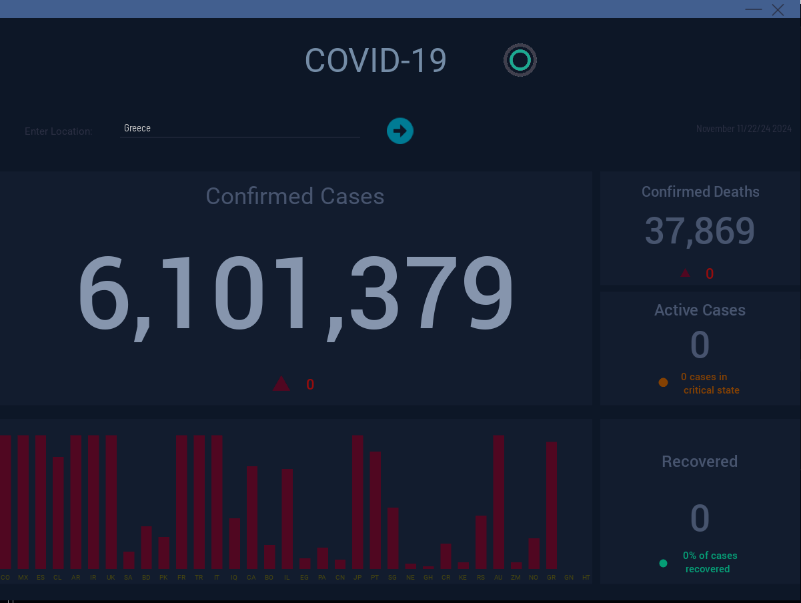
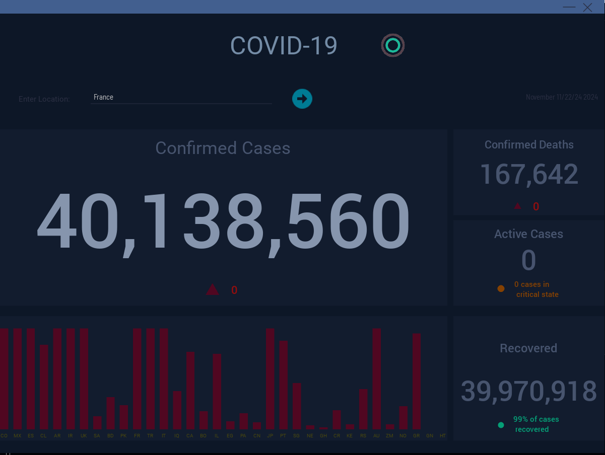
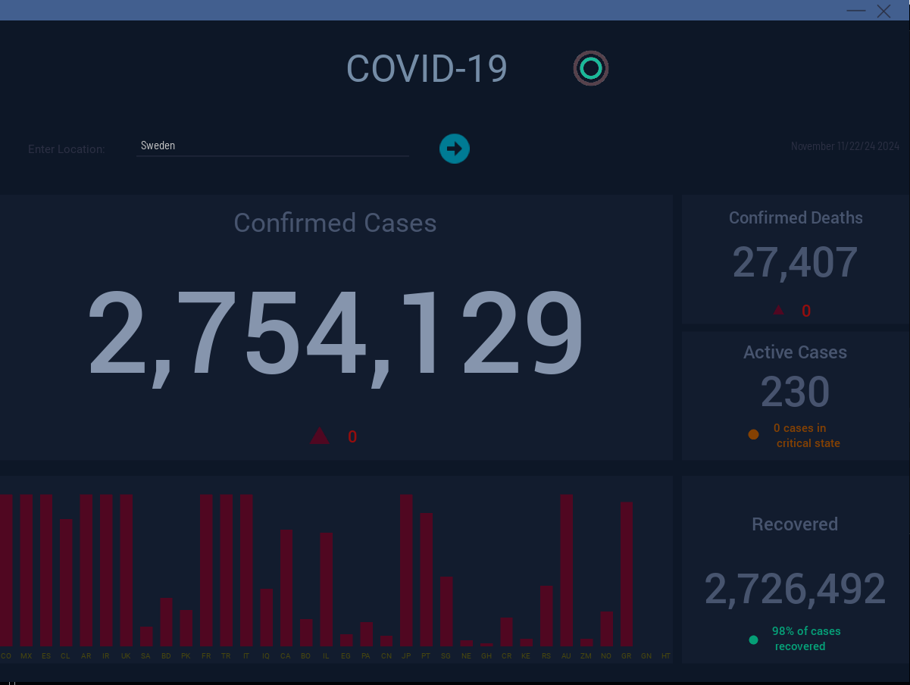

# Health_Desktop_Application
This is a Python-based GUI application designed to track real-time global population health statistics, using the COVID-19 pandemic as a case study. The application provides an interactive dashboard that displays real-time COVID-19 data for various countries using visually appealing bar charts and animations.

## Features 
- Real-time COVID-19 Statistics: Displays updated data including confirmed cases, deaths, recoveries, and active cases per country.
- Global Country Comparisons: Visualizes country-specific case counts as normalized bar charts for quick comparison.
- Search Functionality: Allows users to search for specific countries to view detailed statistics.
- Smooth Animations: Animated transitions and bar chart updates for an engaging user experience.
- Customizable UI: Built with Kivy, featuring a modern, responsive design.

## Screenshots






## Installation

### Prerequisites
- Python 3.11+
- Virtual environment (optional but recommended)

### Step 1: Clone the Repository
```
git clone <repository_url>
cd <repository_name>
```
### Step 2: Install Dependencies
Install the required Python packages:
```
pip install -r requirements.txt
```
### Step 3: Install Fonts (Optional)
Ensure the following fonts are available in your project directory:
- MYRIADPRO-CONDIT.OTF
-d-din.regular.ttf
-Roboto-Medium.ttf
-Roboto-Thin.ttf
-Bistecca.ttf
-Teko-Regular.ttf
-BarlowSemiCondensed-Regular.ttf
-BarlowSemiCondensed-SemiBold.ttf

If these fonts are missing, replace them with system-supported fonts or remove font customization in the code.

## Usage
1. Run the application:
```
python main.py
```
2. The dashboard displays global COVID-19 statistics. Use the search bar to retrieve detailed information about specific countries.

3. Close or minimize the application using the provided buttons.

## Project Structure
```
├── main.py                   # Main application logic
├── bar.py                    # Bar widget for animated charts
├── dashboardscreen.kv        # Kivy layout file for the dashboard
├── icons/                    # Icons and GIFs for UI components
├── fonts/                    # Font files for the UI
├── requirements.txt          # Python dependencies
```

## Key Components
1. main.py
    - Handles application startup, data fetching, and logic for real-time updates.
    - Fetches COVID-19 statistics using the Covid library.
    - Populates the dashboard with bar charts and country data.
2. bar.py
    - Custom Kivy widget for animated bar charts.
    - Configurable properties like orientation, animation type, and colors.
3. dashboardscreen.kv
    - Defines the layout and styling of the dashboard.
    - Includes UI components such as buttons, labels, and the search bar.
    
## Libraries Used
- Kivy: For building the modern, responsive GUI.
- Covid: To fetch real-time COVID-19 statistics.
- ffpyplayer: For GIF animations (if applicable).
- Python Standard Library: For handling dates, strings, and basic logic.

## Known Issues
1. Some animated GIFs may not load properly without the ffpyplayer library.
2. The Covid library may occasionally face API downtime, causing data-fetching issues.
3. Missing fonts may lead to default styling.

## Future Improvements
- Add support for additional health data metrics beyond COVID-19.
- Enhance UI/UX with more interactive visualizations (e.g., line charts or maps).
- Introduce a backend database to store historical data for offline access.

